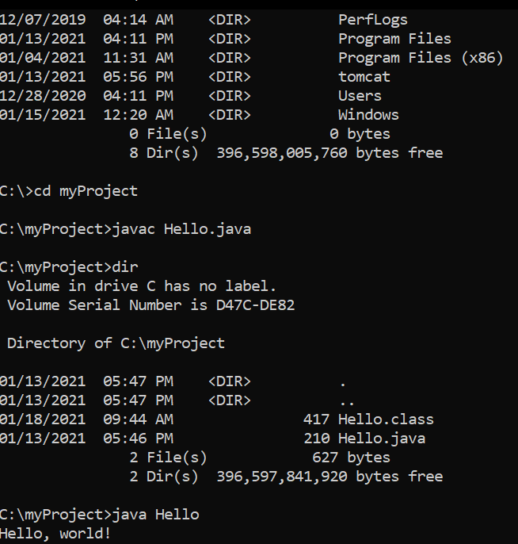
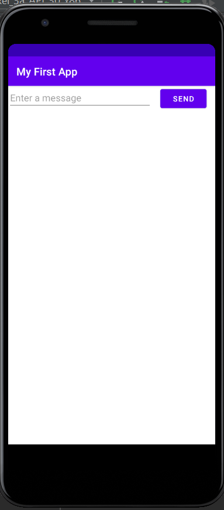
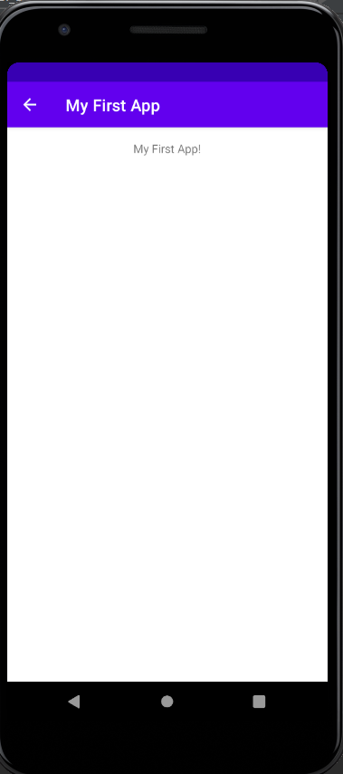

> **NOTE:** This README.md file should be placed at the **root of each of your repos directories.**
>
>Also, this file **must** use Markdown syntax, and provide project documentation as per below--otherwise, points **will** be deducted.
>

# Adv. Mobile App Development

## Justin Davis

### Assignment #1 Requirements:

#### README.md file should include the following items:

* Screenshot of running JDK java Hello
* Screenshot of running Android Studio My First App
* Screenshots of running Android Studio Contacts App
    * a. Main screen with 3 buttons, and contact information w/ image for at least 3 contacts.
    * b. *Must* include background color and design--cannot use "default" activity design.
    * c. *Be sure* to review Chs. 1 and 2 of the course textbook.
* Git commands w/ short descriptions
* Bitbucket repo links:
    * a. This assignment, and
    * b. The completed tutorial repo above (bitbucketstationlocations).

[comment]: <> (> This is a blockquote.)
> 
[comment]: <> (> This is the second paragraph in the blockquote.)
>
> #### Git commands w/short descriptions:

1. git-init - Create an empty Git repository or reinitialize an existing one
2. git-status - Show the working tree status
3. git-add - Add file contents to the index
4. git-commit - Record changes to the repository
5. git-push - Update remote refs along with associated objects
6. git-pull - Fetch from and integrate with another repository or a local branch
7. git-clone - Clone a repository into a new directory

#### Assignment Screenshots:

*Screenshot of running JDK Java Hello:

*Screenshot of running Android Studio My First App*:

*Screenshot of running Android Studio Contacts App:

#### Tutorial Links:

*Bitbucket Tutorial - Station Locations:*
[A1 Bitbucket Station Locations Tutorial Link](https://bitbucket.org/username/bitbucketstationlocations/ "Bitbucket Station Locations")

*Tutorial: Request to update a teammate's repository:*
[A1 My Team Quotes Tutorial Link](https://bitbucket.org/username/myteamquotes/ "My Team Quotes Tutorial")
