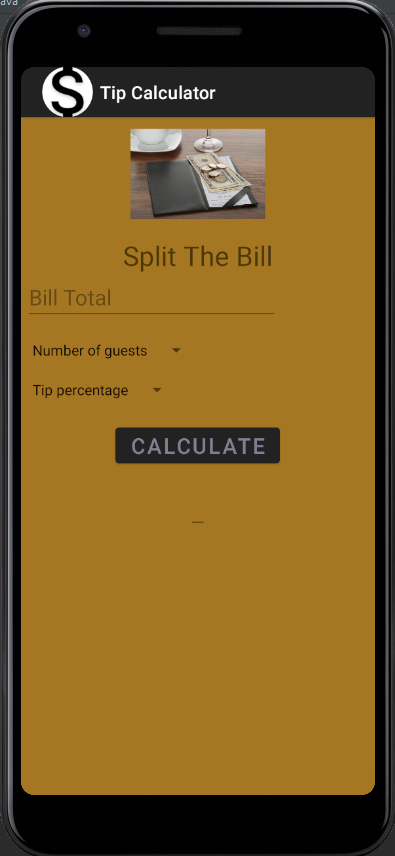
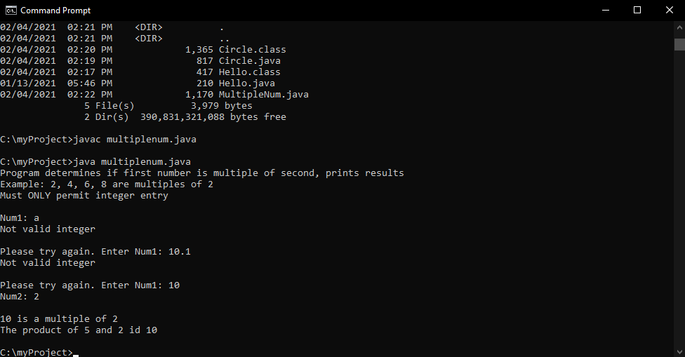

# Advance Mobile App Development

## Justin Davis

### Assignment #2 Requirements:

#### README.md file should include the following items:

* Screenshot of running application's unpopulated requirements, as per A1
* Screenshot of running application's populated user interface

[comment]: <> (> This is a blockquote.)

[comment]: <> (> This is the second paragraph in the blockquote.)

#### Assignment Screenshots:

*Screenshot of running application's unpopulated requirements, as per A1*:

*Screenshot of running application's populated user interface*:

*Tip Calculator App*:

*Screenshot of running JDK SS1-SS3*:

Screenshot of SS1             |  Screenshot of SS2             | Screenshot of SS3             
:-------------------------:|:-------------------------:|:------------------------------------------------:
  |    | 

#### Tutorial Links:

*Bitbucket Tutorial - Station Locations:*
[A1 Bitbucket Station Locations Tutorial Link](https://bitbucket.org/jd19z/bitbucketstationlocations/ "Bitbucket Station Locations")