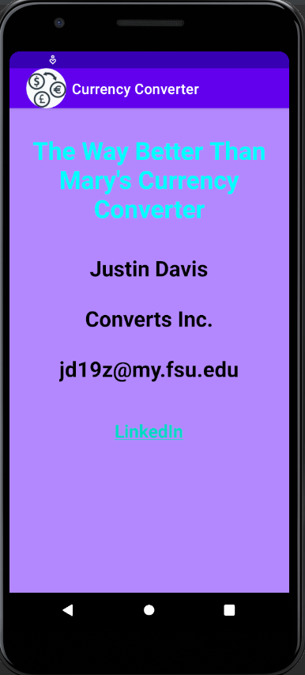

> **NOTE:** This README.md file should be placed at the **root of each of your repos directories.**
>
>Also, this file **must** use Markdown syntax, and provide project documentation as per below--otherwise, points **will** be deducted.
>

# Advance Mobile App Development

## Justin Davis

### Assignment #3 Requirements:

#### README.md file should include the following items:

* Screenshot of running application's splash screen;
* Screenshot of running application's unpopulated user interface;
* Screenshot of running application's toast notification;
* Screenshot of running application's converted currency user interface;

[comment]: <> (> This is a blockquote.)

[comment]: <> (> This is the second paragraph in the blockquote.)

#### Assignment Screenshots:

*Screenshot of running application's unpopulated requirements, as per A1*:

Splash Screen             |  Converting Screen                 
:-------------------------:|:-------------------------:|
  |  

*Screenshot of running application's unpopulated requirements, as per A1*:

Toast Error             |  Gif of Currency Converter                 
:-------------------------:|:-------------------------:|
  |  

*Screenshot of running JDK SS4-SS6*:

Screenshot of SS4             |  Screenshot of SS5             | Screenshot of SS6             
:-------------------------:|:-------------------------:|:------------------------------------------------:
  |    | 

#### Tutorial Links:

*Bitbucket Tutorial - Station Locations:*
[A1 Bitbucket Station Locations Tutorial Link](https://bitbucket.org/jd19z/bitbucketstationlocations/ "Bitbucket Station Locations")