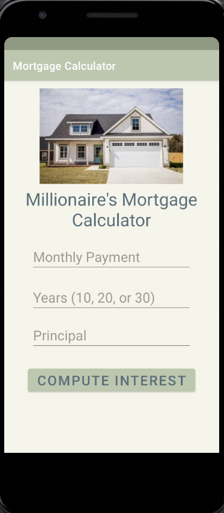

> **NOTE:** This README.md file should be placed at the **root of each of your repos directories.**
>
>Also, this file **must** use Markdown syntax, and provide project documentation as per below--otherwise, points **will** be deducted.
>

# LIS4331 Advance Mobile App Development

## Justin Davis

### Assignment #4 Requirements:

*Sub-Heading:*

1. Include splash screen image (or, create your own), app title, intro text.
2. Include appropriate images.
3. Must use persistent datA: SharedPreferences.
4. Widgets and images must be vertically and horizontally alinged.
5. Must add background color(s) or theme.
6. Create and display launcher iron image.

#### README.md file should include the following items:

* *Screenshot* of running application's splash screen.
* *Screenshot* of running application's invalid screen (with appropriate image).
* *Screenshots* of running application's valid screen (with appropriate image).

#### Assignment Screenshots:

Screenshot of Splash Page             |  Screenshot of Main Page           | Screenshot of Social Page         
:-------------------------:|:-------------------------:|:------------------------------------------------:
  |    | 

*Screenshot of running JDK SS7-SS9*:

Screenshot of SS10             |  Screenshot of SS11             | Screenshot of SS12          
:-------------------------:|:-------------------------:|:------------------------------------------------:
  |    | 

#### Tutorial Links:

*Bitbucket Tutorial - Station Locations:*
[A1 Bitbucket Station Locations Tutorial Link](https://bitbucket.org/jd19z/bitbucketstationlocations/ "Bitbucket Station Locations")