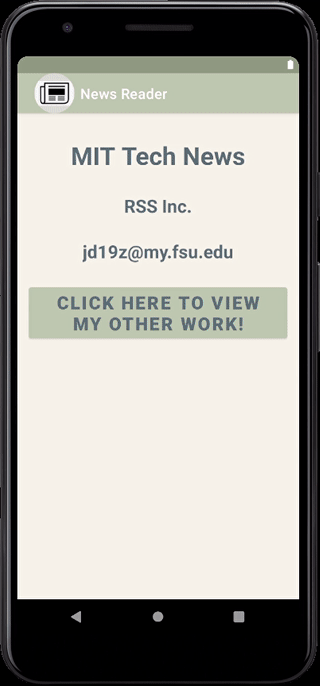
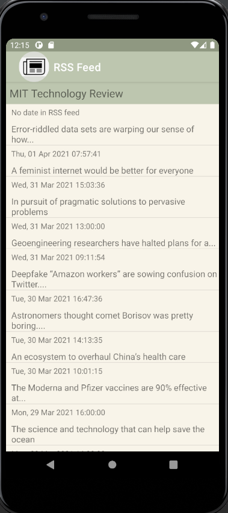
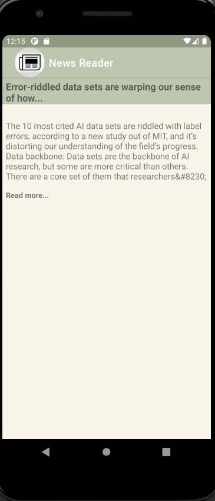
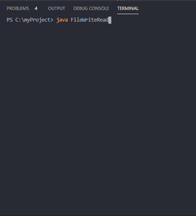
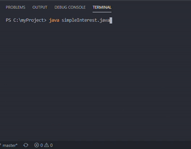
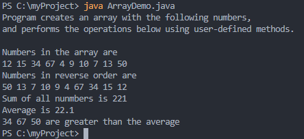

> **NOTE:** This README.md file should be placed at the **root of each of your repos directories.**
>
>Also, this file **must** use Markdown syntax, and provide project documentation as per below--otherwise, points **will** be deducted.
>

# LIS4331 Advance Mobile App Development

## Justin Davis

### Assignment #5 Requirements:

*Sub-Heading:*

1. Include splash screen (optional)
2. Main screen with app title and list of articles
3. Must find and use *your own* RSS feed
4. Must add background color(s) or theme
5. Create and display launcher icon image

#### README.md file should include the following items:

* *Screenshot* of running application's *main screen* (list of articles - activity_items.xml)
* *Screenshot* of running application's *individual article* (activity_item.xml)
* *Screenshot* of running application's *default browser* (article link)

#### Assignment Screenshots:

Screenshot of Splash Page             |  Screenshot of Social Page         
:-------------------------:|:-------------------------:|
  |   

Screenshot of Main Page             |  Screenshot of Individual Page       | Screenshot of Article Link 
:-------------------------:|:-------------------------:|:------------------------------------------------:
  |   | 

#### Skill Sets Code:

[SS13](docs/FileWriteRead.java)

[SS14](docs/simpleInterest.java)

[SS15](docs/ArrayDemo.java)

*Screenshot of running JDK SS13-SS15*:

Gif of SS13             |  Gif of SS14             | Screenshot of SS15          
:-------------------------:|:-------------------------:|:------------------------------------------------:
  |    | 

#### Tutorial Links:

*Bitbucket Tutorial - Station Locations:*
[A1 Bitbucket Station Locations Tutorial Link](https://bitbucket.org/jd19z/bitbucketstationlocations/ "Bitbucket Station Locations")