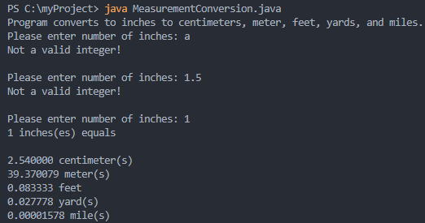

# LIS4331 Advance Mobile App Development

## Justin Davis

### Project 1 Requirements:

*Sub-Heading:*

1. Splash screen image, app title, intro text.
2. Include artists' images and media.
3. Images and buttons must be vertically and horizontally aligned.
4. Must add background color(s) or theme.
5. Create and display launcher icon image.

#### README.md file should include the following items:

* Course title, your name, assignment requirements, as per A1.
* *Screenshot* of running application's splash screen.
* *Screenshot* of running application's follow-up screen.
* *Screenshot* of running application's play and pause user interfaces.

#### Assignment Code:

[MainActivity.java](docs/MainActivity.java)

[SplashActivity.java](docs/SplashActivity.java)

[activity_main.xml](docs/activity_main.xml)

[activity_splash.xml](docs/activity_splash.xml)

#### Assignment Screenshots:

Gif of Application             |  Screenshot of Splash Page
:-------------------------:|:-------------------------:|
  |   |

Screenshot of Main Page            |  Screenshot of Playing Music  
:-------------------------:|:-------------------------:|
  |    |

#### Skill Sets Code:

[SS7](docs/MeasurementConversion.java)

[SS8](docs/DistanceCalculator.java)

[SS9 Part 1](docs/MultipleSelectionFrame.java)
[SS9 Part 2](docs/MultipleSelectionListDemo.java)

*Screenshot of running JDK SS7-SS9*:

Screenshot of SS7             |  Screenshot of SS8             | Screenshot of SS9             
:-------------------------:|:-------------------------:|:------------------------------------------------:
  |    | 

#### Tutorial Links:

*Bitbucket Tutorial - Station Locations:*
[A1 Bitbucket Station Locations Tutorial Link](https://bitbucket.org/jd19z/bitbucketstationlocations/ "Bitbucket Station Locations")