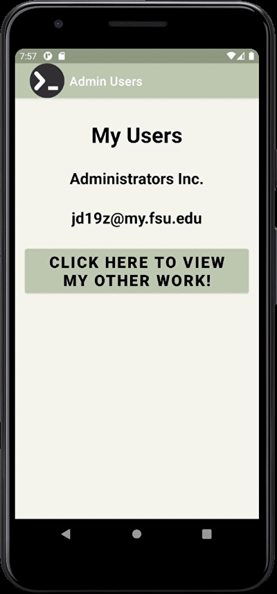
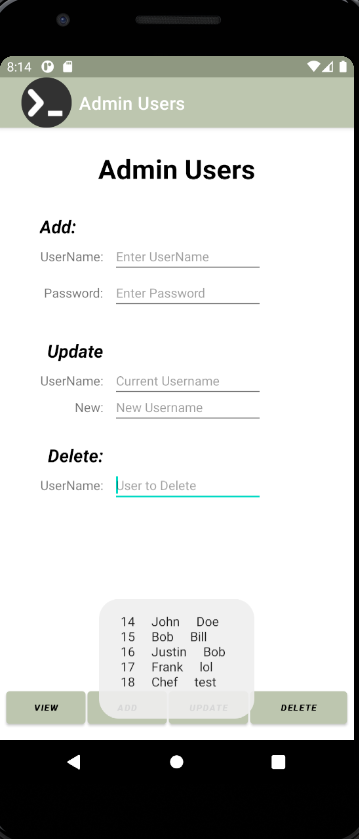
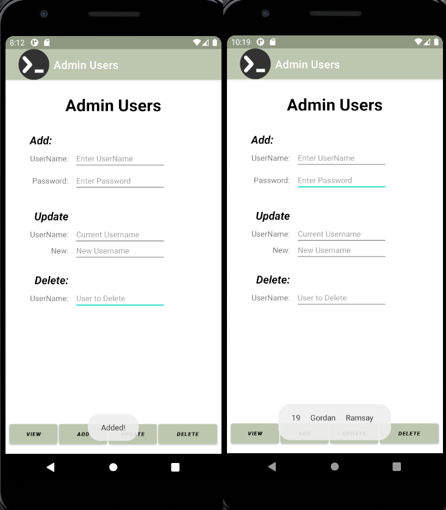
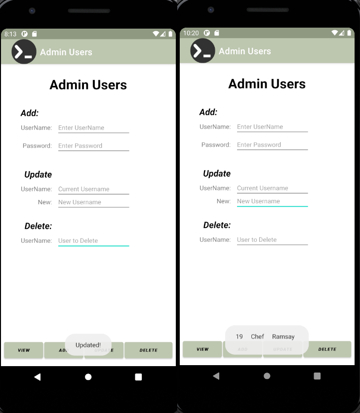

> **NOTE:** This README.md file should be placed at the **root of each of your repos directories.**
>
>Also, this file **must** use Markdown syntax, and provide project documentation as per below--otherwise, points **will** be deducted.
>

# LIS4331 Advance Mobile App Development

## Justin Davis

### Project 2 Requirements:

*Sub-Heading:*

1. Splash screen image, app title, intro text.
2. Must use persistent data: SQLite database.
3. Insert at least five users.
4. Must add background color(s) or theme.
5. Create and display launcher icon image.

#### README.md file should include the following items:

* Course title, your name, assignment requirements, as per A1.
* *Screenshot* of running application's splash screen.
* *Screenshot* of running application's Main screen.
* *Screenshot* of running application's add, update, and delete functions.

#### Assignment Code:

[MainActivity.java](docs/MainActivity.java)

[SplashActivity.java](docs/SplashActivity.java)

[Message.java](docs/Message.java)

[myDbAdapter.java](docs/myDbAdapter.java)

[Socials.java](docs/Socials.java)

[activity_main.xml](docs/activity_main.xml)

[activity_splash.xml](docs/activity_splash.xml)

[activity_socials.xml](docs/activity_socials.xml)

#### Assignment Screenshots:

Screenshot of Splash Page            |  Screenshot of Social Page | Screenshot of Main Page
:-------------------------:|:-------------------------:|:-------------------------:|
  |    |  

Screenshot of Added User            |  Screenshot of Updated User | Screenshot of Deleted User
:-------------------------:|:-------------------------:|:-------------------------:|
  |    |  

#### Tutorial Links:

*Bitbucket Tutorial - Station Locations:*
[A1 Bitbucket Station Locations Tutorial Link](https://bitbucket.org/jd19z/bitbucketstationlocations/ "Bitbucket Station Locations")